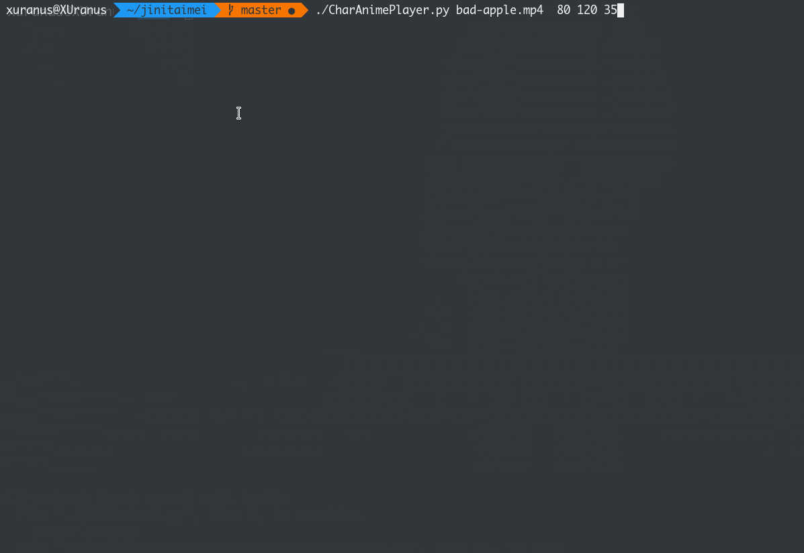

# CharAnimePlayer
用opencv读取视频帧，压缩，构造灰度字符串，用字符串替换像素。实现在终端播放字符动画。

## 安装
需要:
 - python3
 - opencv
 - pygame
 - moviepy

安装：
`sudo pip install -r requirements.txt`

## 样例
在终端播放“鸡你太美”
```bash
python jinitaimei.py
```
效果如下：


## 即时播放
播放指定的任意**mp4**文件：
```bash
python CharAnimePlayer.py [movie] [fps] [width] [height] [--audio]
```
样例 (Bad Apple):
```
./CharAnimePlayer.py bad-apple.mp4 60 120 35 --audio
```


> 当附带`--audio`时，可以开启声音（**尚未解决音画同步的问题**）。

> 该种播放方式是一边转化帧为灰度字符串，一边播放，配置不行的可能会卡。建议用该种模式调试适合你的屏幕的宽高以及帧率，然后选用下面预处理再播放的方式获得更流畅的体验。

## 预处理播放
对于一个`ikun.mp4`文件预处理播放的方式如下:

1. clone该repo，导入文件
```python
import sys
sys.path.append('./')
from CharAnimeBuilder import *
from CharAnimePlayer import *
```
2. 生成预处理文件
```python
arr =  "@@@@@@@@@*abcdefghijklmnopqrstuvwxyz<>()\/{}[]? " #构造合适的灰度字符串
builder = CharAnimeBuilder(arr,'ikun.mp4') 
width = 130 #输入宽高
height = 40 
builder.build(width, height, './ikun.dat') #生成预处理文件路径
```

3. 此时目录下已经出现了`ikun.dat`的预处理文件，加载该文件,设置帧率，初始化播放器
```python
fps = 20 #帧率 根据自己卡不卡来调节 范围1-60
player = CharAnimePlayer.newFramesPlayer('./ikun.dat',fps) #载入之前的ikun.dat文件
```

4. 播放
```python
player.play()
```

